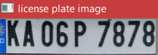
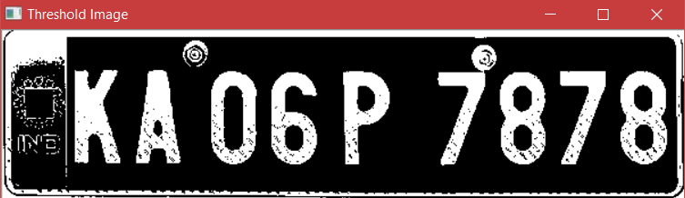
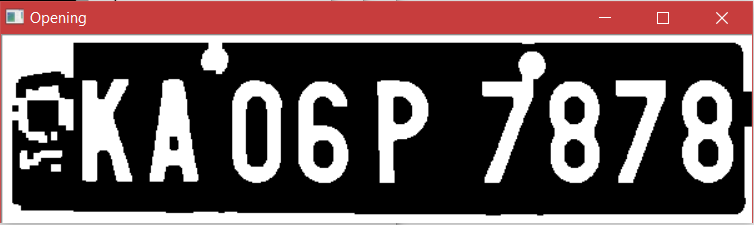
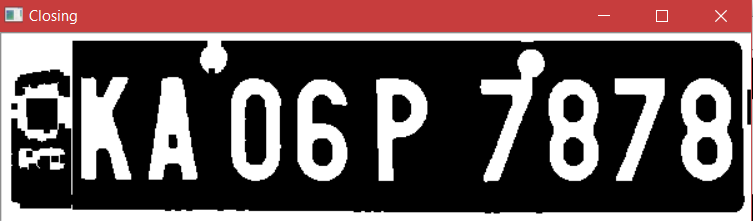
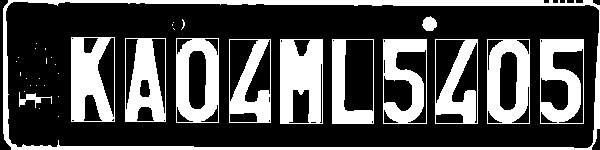
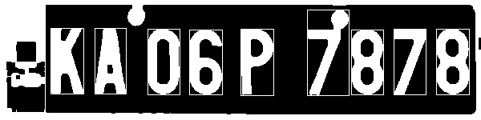
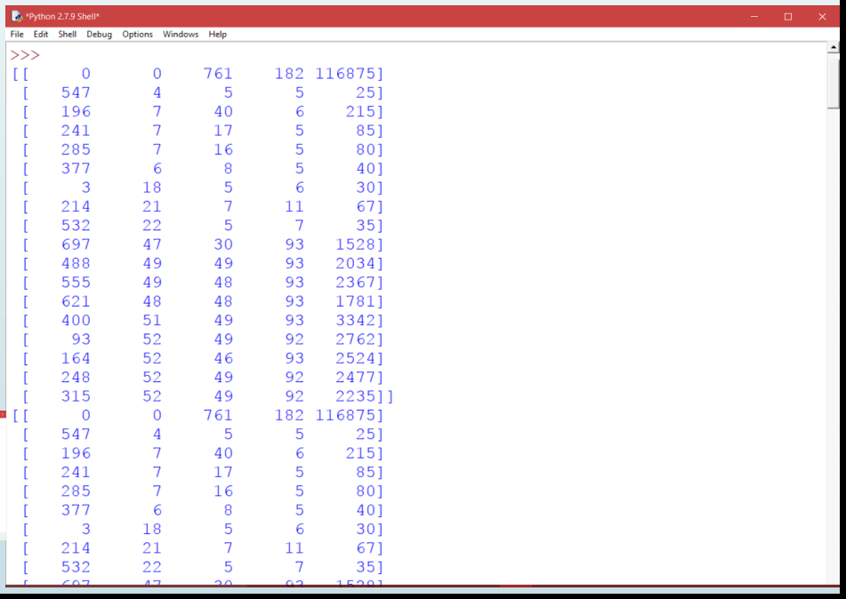
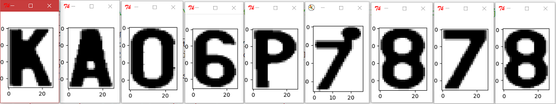
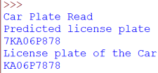

# Character-Recognition-and-Segmentation using SVM
The License Plate have been extracted from Preprocessing Step and then Character segmenation is done using Connected Component Analysis based on the width, height and area we can threshold the values and segment the characters.
 
For Recognition Training of characters is used Alphabets(A-Z) and Numerals(0-9) each having 25images and Trained for 17 images and Genetrate the .sav file.
 
Then the segment characters are then passed to the Recognizer for Recognition of Characters using Support Vector Machine(SVM).

# Character Segmentation
Standard license plates offer a great advantage in LPR because they mostly consist ofsmooth backgrounds and highly contrasted characters. A smaller percentage of vehiclescarry standard license plates. However, the license plates with different stylish fonts areincreasing in popularity, and it is important to consider strategies for proper segmentationand recognition since significant majority of vehicles carry such license plate. In this chapter, the segmentation of alphanumeric symbols from the license plate is discussed.Performance of the character recognition module in LPR, will rely heavily on the efficiency
of the plate text segmentation. 
#
Licens plate extraction from preprocessing step
#

#
Binarised License plate
#

#
The binarised license plate has noise we will follow operation opening followed by closing operation.
#
Opening
#

#
Closing
#

#
# Connected Component Analysis Approach
The CCA can be applied to an entire license plate. Each object extracted is thus acharacter extracted. Hence this method of character extraction requires the characters tobe just separated in the license plate. The objects with very small or a very large widthor height can be neglected as they dont correspond to characters.The CCA stats for sample image is as shown in the Figure below. Based on the aspect ratio,area and height of characters, extraction of the characters from the license plate is shown in Figure.
#
#

#

#
CCA Stats of sample image
#

#
Extraction of characters from license plate
#

#
# Support Vector Machine Classification
SVM belongs to kernel methods or class of maximum margin hyperplane classifiers. The SVM map data from original space to the higher dimensional feature space. SVM classifier is utilized for recognition between two classes by finding a optimum hyperplane that has most extreme separation to the closet points in the preparation set named as support vectors.

SVM is used as a multi - class classifier. One against one is the approach employed for the classification. The system is
trained with the number of classes set at 36 including 10 numerals and 26 English alphabet letters. The size of segmented characters varies greatly. In this phase, all characters are standardized by image mapping technique to a size of 27 X 36. Now, the characters size 27 X 36 is converted to binary image. The resulting vector is reshaped with the command binary_image.reshape(-1). Then we are appending the vector of same letter or number under one whole vector set. For example Charater A we have selected 15 images for letter A so the resulting vector for all the 15 letters is tored in one array. We will train the model and identify the segemented characters from the CCA.  

The Result after applying the SVM trained model for identifying the characters. If you see there is a difference between the readings. Due to order variation of plate this has occurred due to variation in area region then we put condition to arrange this by arranging based on column order.
#

#

# Explaining about files commited 
1. Python programme for SVM Classification is present in files SVM-17images.py and SVM-train for 17 images.ipynb.
2. Segemetation and Recoginition file where CCA is implemented and also the trained model of indetifying the charaters is present in it. 
3. TrainRecognizeCharaters_SVM.py and SVM-Test.ipynb is the file for evaluating the trained model is correct or not.
4. The training set of images used in this project is present in Training.rar and Training.zip
5. Some examples pictures have been uploaded
6. character_model_svm_success.sav ---> Trained model for predicted or identifying the images.

# Additional Information
For more information about this individual steps I have created separate repository for each step please refer to it. The information is also found in Report that i have uploaded. For understanding the project you can also refer to the Presentation or PPT file being uploaded.

You can also see refer to IEEE website where I have published paper on this Link : https://ieeexplore.ieee.org/document/9002409.
